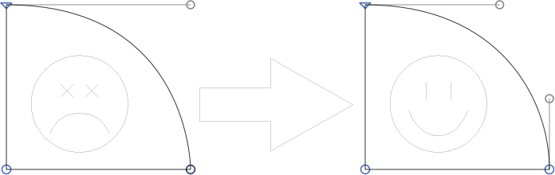

# FixZeroHandles.glyphsFilter

This is a plugin for the [Glyphs font editor](http://glyphsapp.com/) by Georg Seifert. It analyzes the path structure of selected layers and will rearrange path segments that contain completely retracted handles, a.k.a. ‘zero handles’. If both handles of a curve segment are retracted, the segment will be turned into a straight line segment.

Zero handles typically appear in outlines imported from other vector apps, such as Adobe Illustrator. Zero handles are considered bad style, or even an error, and can cause a range of problems, especially when you are trying to convert your outlines to TrueType curves. Zero handles can seriously mess up the screen rendering of a font, especially on Apple devices. Here is a screenshot from iOS. Can you spot the glyphs that have zero handles?

Installation of this filter will add the menu item *Filter > Fix Zero Handles* (de: *Null-Anfasser beheben,* fr: *Corriger les poignées rétractées,* es: *Corregir manejadores cero,* zh: 修正单摇臂). You can set a keyboard shortcut in System Preferences.

### Installation

1. In *Window > Plugin Manager,* look for *Fix Zero Handles* and click *Install.*
2. Restart Glyphs

### Usage Instructions

1. Open a glyph in Edit View, or select any number of glyphs in Font or Edit View.
2. Choose *Filter > Fix Zero Handles*.

Alternatively, you can also use it as a custom parameter in an instance:

	Property: Filter
	Value: FixZeroHandles;

At the end of the parameter value, you can hang `exclude:` or `include:`, followed by a comma-separated list of glyph names. This will apply the filter only to the included glyphs, or the glyphs not excluded, respectively.

### Requirements

The plugin needs Glyphs 2.3 or higher, running on OS X 10.9 or later.

### License

Copyright 2014-2018 Rainer Erich Scheichelbauer (@mekkablue).
Based on sample code by Georg Seifert (@schriftgestalt).

Licensed under the Apache License, Version 2.0 (the "License");
you may not use this file except in compliance with the License.
You may obtain a copy of the License at

http://www.apache.org/licenses/LICENSE-2.0

See the License file included in this repository for further details.
